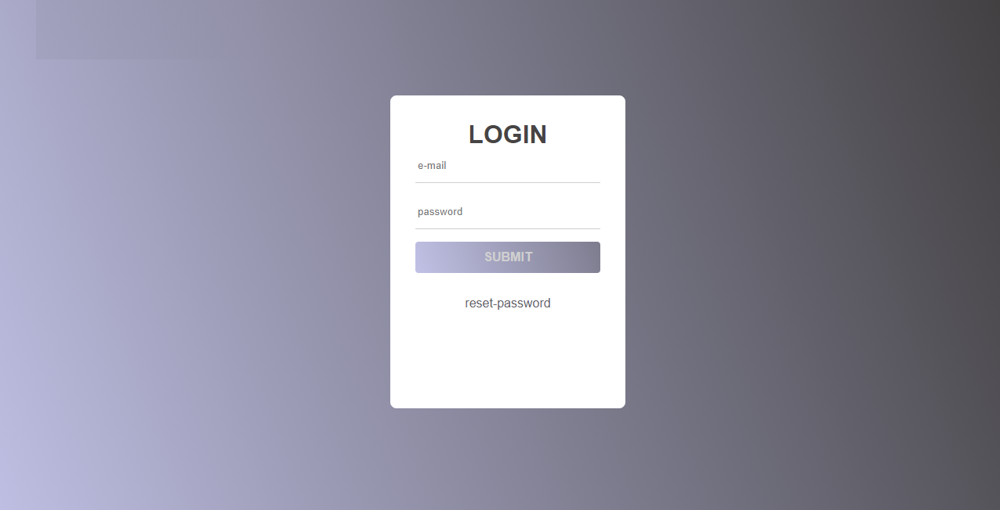

[ <em>FORMULÁRIO DE LOGIN COM HTML E CSS ANIMADO</em>](https://github.com/edukurosaki/EducationalProjects.git)

<h1>PROJETOS PARA APRENDIZADO</h1>

> Status do Projeto: sempre em andamento :runner:

# Descrição do Projeto :star

Neste projeto de estudo, sera colocado exercicios diversos de projetos propostos por outros parceiros DEVS e resultados de mini-dicas propostas.

## Tecnologias Aplicadas

- :computer: Html5;
- :computer: CSS;

## Pré-Requisitos

- [VSCode](https://code.visualstudio.com/docs)
- Ou outro editor

## Contribuintes

  [ <em>Gabriela Pinheiro com FORMULÁRIO DE LOGIN COM HTML E CSS ANIMADO</em>](https://www.instagram.com/ga.brielapinheiro)

  [<em>Visite Gabriela Pinheiro no youtube</em>](https://www.youtube.com/GabrielaPinheiro)

## Meus Contatos e Redes Sociais

- :email: eduardo@secautomation.com.br

- 🔗 https://linkedin.com/in/eduardo-alves-francisco

- 🕸️ https://github.com/edukurosaki
